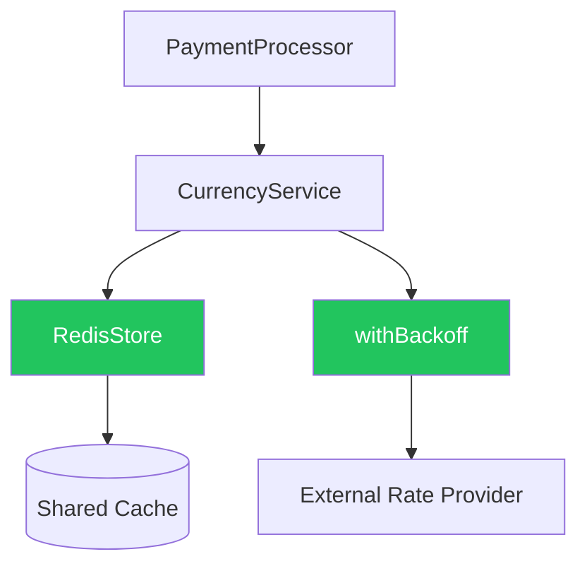
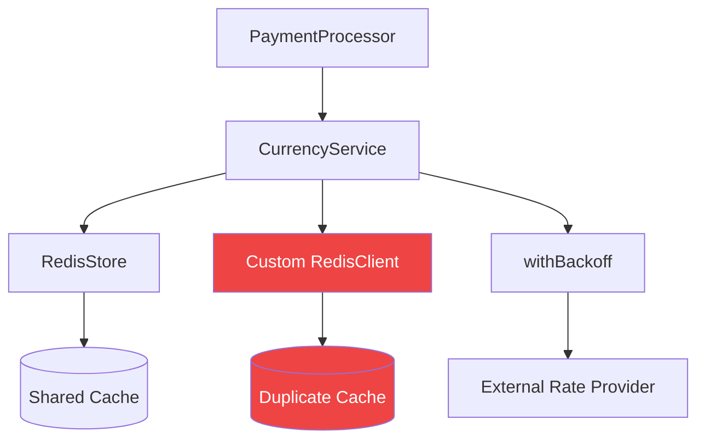

# IntentLoop Review Dossier

**Generated:** 2026-09-27T05:17:28.737Z
**Feature:** Currency Rate Caching
**PR:** #142 — Add Currency Rate Caching
**Intent Alignment:** 68%

---

## Summary

The implementation partially satisfies the architectural contract. Caching and retry logic are present, but the implementation bypasses the approved cache abstraction and introduces a breaking interface change in an unmodified downstream consumer.

---

## Architectural Contract

**Feature:** Currency Rate Caching

### Requirements

- [x] Cache exchange-rate responses
- [x] Use retry/backoff logic
- [x] Handle cache failures gracefully
- [ ] Reuse RedisStore

**Contract Coverage:** 3 / 4 requirements satisfied

---

## Intent Drift Findings

### HIGH: Direct Cache Client Instantiation

**File:** `src/services/currency_service.ts` (line 17)
**Rule:** ADR-012

**Design Intent:** Reuse: pkg/cache/redis_store.ts

**Actual Implementation:** CurrencyService creates a separate cache client (class RedisClient { ... })

**Why This Matters:** The implementation duplicates connection ownership and bypasses the approved caching infrastructure. Under load this creates duplicate Redis connection pools, risking resource exhaustion.

**Suggested Fix:** Remove the local RedisClient class. Accept CacheStore via constructor injection and use the shared RedisStore instance from pkg/cache/redis_store.ts.

---

## Blast Radius Analysis

**Unmodified files at risk:** 1

### HIGH RISK: `src/services/checkout/payment_processor.ts`

⚠️ **This file was NOT modified in the Pull Request.**

**Reason:** Calls getRate("USD", "PHP") — string arguments incompatible with new CurrencyEnum signature.

**Reference:** Line 29: this.currencyService.getRate(currency, targetCurrency)

---

## Verification Results

- [x] Cache hit
- [x] Cache miss (fallthrough)
- [x] Retry behavior
- [x] Cache failure graceful degradation
- [ ] Checkout compatibility — PaymentProcessor.processCheckout fails — getRate type mismatch

---

## Architecture: Expected vs Actual

### Expected

### Actual

---

## Recommended Remediation

### Direct Cache Client Instantiation

Remove the local RedisClient class. Accept CacheStore via constructor injection and use the shared RedisStore instance from pkg/cache/redis_store.ts.

### Interface Compatibility Break in Unmodified Consumer

Either: (a) revert the signature to string-based and use CurrencyEnum internally, or (b) add a backwards-compatible overload, or (c) update PaymentProcessor to use CurrencyEnum.

---

*Generated by Bob IntentLoop*
